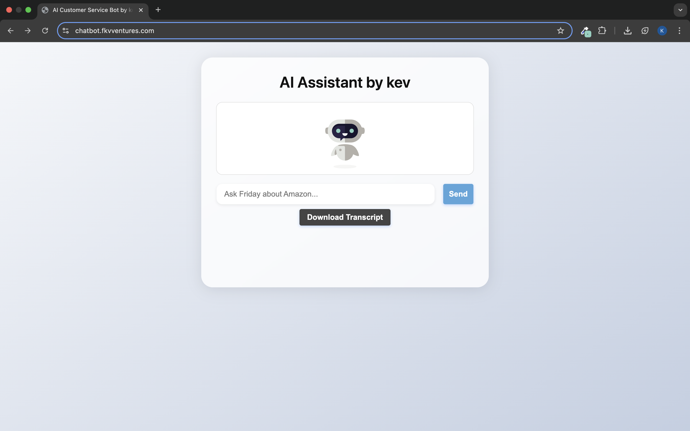

# AI Customer Assistant — Serverless Chatbot Built with Bedrock, Lambda, and Terraform on AWS


This is a fully serverless AI chatbot built with Amazon Bedrock (Titan G1), Lambda, and Terraform, designed to answer customer questions in real time based on a curated FAQ prompt. The frontend is deployed using AWS Amplify with a custom Route 53 domain, and all interactions are logged in DynamoDB for session tracking.

---

## Demo

**Watch the full demo on YouTube**  


[Watch the YouTube demo](https://www.youtube.com/watch?v=VCxfDRWnaK0)

---

## Architecture


---

**Live Chatbot UI:**  


**Chat Example:**  


**Transcript Feature:**  

> *Note: The service is turned off to reduce AWS costs. All infrastructure can be redeployed using this repo.*


---
## How It Works

1. **User** types a question into the Amplify-hosted chatbot UI.
2. The frontend sends a `POST /chat` request via **API Gateway**.
   
3. API Gateway invokes a **Lambda function**.
4. Lambda injects the user input into a pre-defined **FAQ prompt**.
5. The prompt is sent to **Amazon Bedrock (Titan G1)** and a response is returned.
   
6. Lambda returns the message and logs it into **DynamoDB**.
     
7. Session logs are viewable via DynamoDB and CloudWatch.
   

---

## Deployment with Terraform

Clone and deploy:

```bash
git clone https://github.com/yourusername/ai-customer-bot.git
cd terraform
terraform init
terraform apply
```

You will deploy:
- ✅ IAM roles & policies  
  
- ✅ Lambda function  
  
- ✅ API Gateway  
  
- ✅ DynamoDB table  
  
- ✅ Route 53 + Amplify (custom domain setup via AWS Console)  
  The frontend was deployed using Amplify and connected to GitHub for CI/CD. A custom subdomain (`chatbot.fkvventures.com`) was added using Route 53.  
  SSL is managed by Amplify with AWS-managed ACM certificates.  
  Some parts of the setup — like domain connection and certificate validation — were done manually through the AWS Console due to Terraform limitations with Amplify and Route 53.  
  [Official AWS setup guide](https://docs.aws.amazon.com/amplify/latest/userguide/custom-domains.html)  
  


---

## Services Used

| Layer       | Service                         |
|-------------|----------------------------------|
| Frontend    | AWS Amplify + Route 53           |
| API         | Amazon API Gateway (HTTP)        |
| Compute     | AWS Lambda                       |
| AI Model    | Amazon Bedrock – Titan Text G1   |
| Database    | DynamoDB (chat session log)      |
| Monitoring  | CloudWatch (Lambda auto-logs)    |
| Infra-as-Code | Terraform (backend only)       |

---

## DynamoDB Table

**Table Name:** `chat_history`  
**Partition Key:** `session_id` (String)

---

## 🔧 Future Enhancements

- Swap Titan with Claude (also via Bedrock)
- Load FAQ data dynamically from S3

---

## Connect with Me

📫 [LinkedIn](https://www.linkedin.com/in/franc-kevin-v-07108b111/)